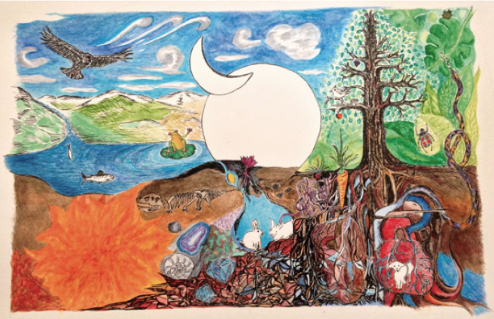

# nature-of-code-final-project
# Underground

This project is the first step of an exploration about some narrative possibilities in digital animation. In the future I would like to create small interactive stories for kids that incorporates elements of randomness and generative development in the narrative.

For this final project I decided to create a landscape that allows me to start creating stories.

Inspiration

This draw is a static/hand made inspiration of what I would like to create in digital media with movements and interactions.

I get inspired also from sketches that I found in open processing and in the book Nature of Code of Daniel Shiffman.

For Tree and Roots:
Ryan Chon: https://www.openprocessing.org/sketch/158950
Barbara Almeida: https://www.openprocessing.org/sketch/184276
Barbara Almeida: https://www.openprocessing.org/sketch/313654
Daniel Shiffman Nature of Code Exercise_8_06_Tree (Recursive Tree)
For Mountains:
Barbara Almeida: https://www.openprocessing.org/sketch/179401
